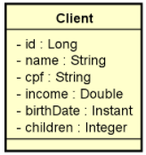

CRUD completo de web services REST para acessar um recurso de clientes, contendo as cinco operações básicas aprendidas no capítulo:

* Busca paginada de recursos

* Busca de recurso por id

* Inserir novo recurso

* Atualizar recurso

* Deletar recurso

O projeto deverá estar com um ambiente de testes configurado acessando o banco de dados H2, deverá usar Maven como gerenciador de dependência, e Java 11 como linguagem.
Um cliente possui nome, CPF, renda, data de nascimento, e quantidade de filhos. A especificação da entidade Client é mostrada a seguir (você deve seguir à risca os nomes de classe e atributos mostrados no diagrama):

