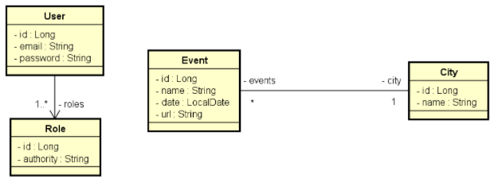

Implementadando as funcionalidades necessárias para que os testes do projeto passem.

Este é um sistema de eventos e cidades com uma relação N-1 entre eles:

Neste sistema, somente as rotas de leitura (GET) de eventos e cidades são públicas (não precisa de login). Usuários CLIENT podem também inserir (POST) novos eventos. Os demais acessos são permitidos apenas a usuários ADMIN.

Validações de City:

* Nome não pode ser vazio

Validações de Event:

* Nome não pode ser vazio

* Data não pode ser passada

* Cidade não pode ser nula

