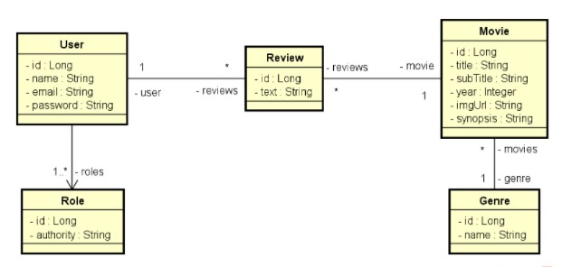

Implementando as funcionalidades necessárias para que os testes do projeto passem.

Diagrama do sistema:



Implementar as três etapas:

* Implementar o modelo conceitual proposto, com seed do banco de dados.

* Incluir a infraestrutura de exceções, validação e segurança ao projeto.

* Implementar o endpoint mostrado abaixo.

Requisitos do seed para os testes passarem:

* Seu seed deve conter dois usuários:
  * Usuário somente com perfil VISITOR:
    - email: bob@gmail.com
    - senha: 123456
  
  * Usuário com perfil MEMBER:
    - email: ana@gmail.com
    - senha: 123456

Endpoint que deverá ser feito:

1) Obter o perfil do usuário logado: ```GET /users/profile```

Mínimo para aprovação: 8/8

