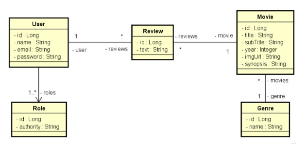

Implementando as funcionalidades necessárias para que os testes do projeto passem.

Diagrama do sistema:

Implementar as duas etapas:

* Implementar o modelo conceitual proposto, com seed do banco de dados.

* Incluir a infraestrutura de exceções, validação e segurança ao projeto.

Requisitos do seed para os testes passarem:

* Seu seed deve conter dois usuários:
  * Usuário somente com perfil VISITOR:
    - email: bob@gmail.com
    - senha: 123456
    - role: VISITOR
  * Usuário com perfil MEMBER:
    - email: ana@gmail.com
    - senha: 123456
    - role: MEMBER

Casos de uso

Efetuar login

* [IN] O usuário anônimo informa seu email e senha

* [OUT] O sistema informa um token válido

Listar filmes

* [OUT] O sistema apresenta uma listagem dos nomes de todos gêneros, bem como uma listagem paginada com título, subtítulo, ano e imagem dos 
filmes, ordenada alfabeticamente por título.

* [IN] O usuário visitante ou membro seleciona, opcionalmente, um gênero.

* [OUT] O sistema apresenta a listagem atualizada, restringindo somente ao gênero selecionado.

Visualizar detalhes do filme

* [IN] O usuário visitante ou membro seleciona um filme

* [OUT] O sistema informa título, subtítulo, ano, imagem e sinopse do filme, e também uma listagem dos textos das avaliações daquele filme juntamente com nome do usuário que fez cada avaliação.

* [IN] O usuário membro informa, opcionalmente, um texto para avaliação do filme.

* [OUT] O sistema apresenta os dados atualizados, já aparecendo também a avaliação feita pelo usuário.

Exceção 3.1 - Texto vazio

3.1.1. O sistema apresenta uma mensagem de que não é permitido texto vazio na avaliação 

Mínimo para aprovação: 12/15
